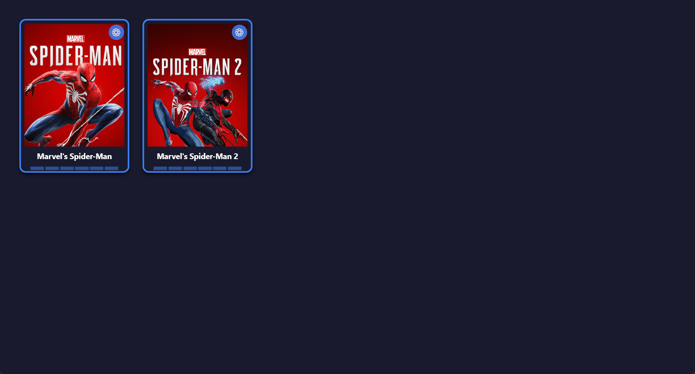
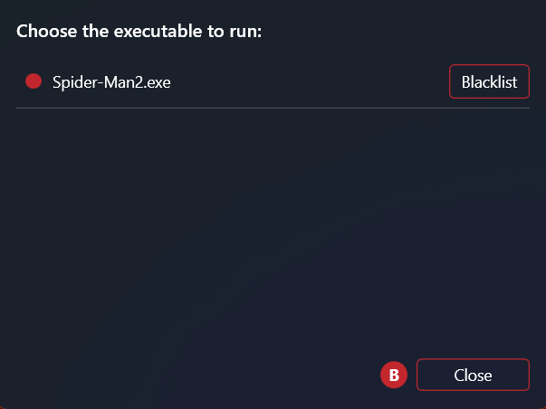

# SSD Launcher

A plug-and-play game launcher for portable SSDs, built with WPF (.NET). Plug in an
external drive with a compatible folder structure, and the app automatically detects
it, builds a library from what's on it, and lets you launch games with a mouse or Xbox-compatible controller — all styled to look like a shelf of game
cartridges, themed per-drive.

## Screenshots

*(Coming soon)*

<!-- 


-->

## Features

- **Automatic drive detection** — watches for new drives via WMI (`Win32_VolumeChangeEvent`)
  and reacts the moment a compatible SSD is plugged in. A manual "Scan" option (from the
  tray icon) also checks already-connected drives, for cases where the drive was plugged
  in before the app started.
- **Per-game executable discovery** — scans each game's folder for `.exe` files, with a
  built-in and user-editable blacklist to exclude installers, uninstallers, crash
  reporters, etc. from being offered as launch targets.
- **Manual executable selection** — if a game has multiple `.exe` files, pick which one
  launches from a dedicated settings window; blacklist any of them on the spot.
- **Per-drive theming** — each SSD can ship its own `Design/theme.json` (accent color,
  background color, font) and background image, applied live the moment the drive is
  detected — no restart required.
- **Cartridge-style UI** — custom WPF styling with hover/focus animations, built on top
  of WPF's built-in Fluent theme.
- **Controller support** — navigate the library with a D-pad, launch with A, open the
  executable/blacklist settings with Y, and go back with B. Shows an on-screen button
  hint automatically when a controller is detected.
- **Runs in the background** — starts with Windows, lives in the system tray, and pops
  the window to the foreground automatically when a compatible drive is detected.

## How it works

The app looks for a specific folder structure at the root of a connected drive:

```
E:\
├── Config.csv              # OpenWhenPlugged;TRUE
├── Games.csv                # {Id};{Name} — one line per game
├── Games\
│   └── {Id}\                 # the game's own folder/files; .exe files are auto-discovered
├── Images\
│   └── {Id}.jpg|png|jpeg|webp   # cover art, matched by game Id
└── Design\                   # optional — omit for the default theme
    ├── theme.json             # { "AccentColor": "#...", "BackgroundColor": "#...", "FontFamily": "..." }
    └── background.jpg|png|jpeg|webp
```

`Config.csv` and `Games.csv` are plain `;`-delimited text files with no header row.

## Controller reference

| Button | Action |
|---|---|
| D-pad | Navigate the library / settings list |
| A | Launch the focused game / activate the focused item |
| Y | Open executable-selection & blacklist settings for the focused game |
| B | Close the settings window |

## Requirements

- Windows 10/11
- [.NET 10 or later](https://dotnet.microsoft.com/) desktop runtime
- An XInput-compatible controller (Xbox-type; most modern pads, including PS5
  controllers on Windows) for gamepad navigation — optional, the app works fully with
  mouse and keyboard otherwise

## Project structure

- **`Library`** — plain class library with no UI dependencies: models (`Game`,
  `LauncherTheme`) and services (drive watching, game scanning, launching, theme
  loading, Windows startup registration).
- **`SSDLauncher 2.0`** — the WPF application: views, view models (MVVM via
  [CommunityToolkit.Mvvm](https://github.com/CommunityToolkit/dotnet)), controller
  input handling, and the system tray integration (via
  [Hardcodet.NotifyIcon.Wpf](https://github.com/HavenDV/H.NotifyIcon)).

## Building

1. Install Visual Studio 2026 (or later) with the **.NET desktop development** workload.
2. Clone the repo and open `SSDLauncher.sln`.
3. Build the solution — NuGet packages (`CommunityToolkit.Mvvm`,
   `Hardcodet.NotifyIcon.Wpf`) restore automatically.
4. Set `SSDLauncher 2.0` as the startup project and run.

No external services, API keys, or configuration are needed to build and run the app
itself — everything it reads comes from the connected drive at runtime.

## Possible future improvements

- In-app SSD setup wizard — configure a blank drive with the required folder structure directly from the app,
  then add games (with cover art) by copying them onto the drive from within the UI,
  instead of hand-building `Config.csv`/`Games.csv` and folders manually.
- In-app theme designer — a visual editor for a drive's `Design/theme.json` and background image, instead of hand-editing files on the drive.
- Support for multiple simultaneously connected drives/controllers
- Held-direction auto-repeat for D-pad navigation

## License

MIT — see [LICENSE](LICENSE) for details.
